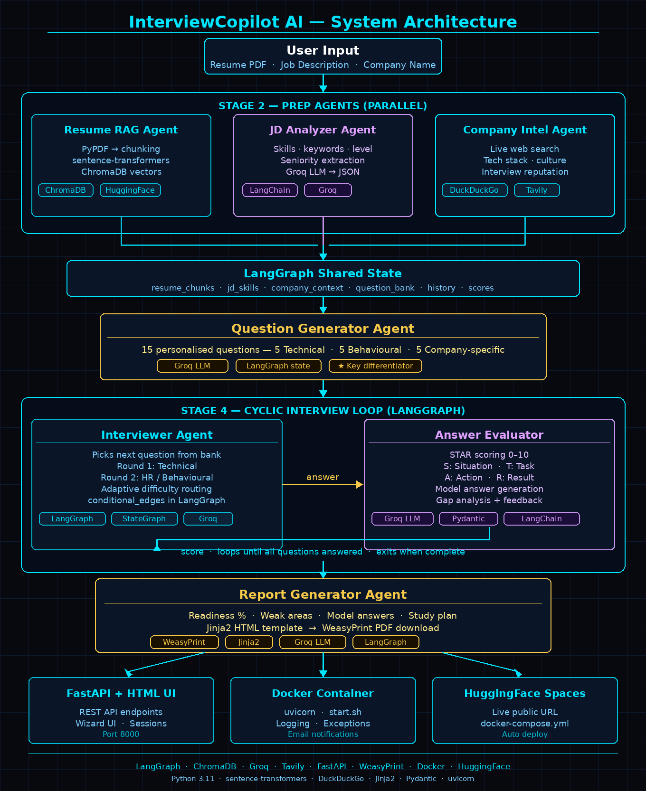
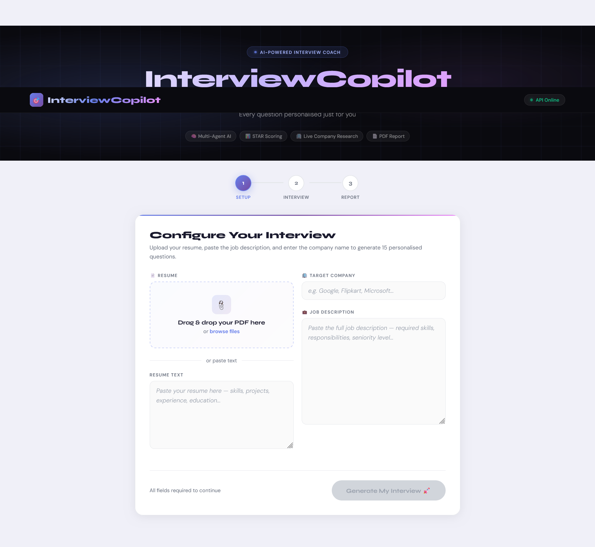
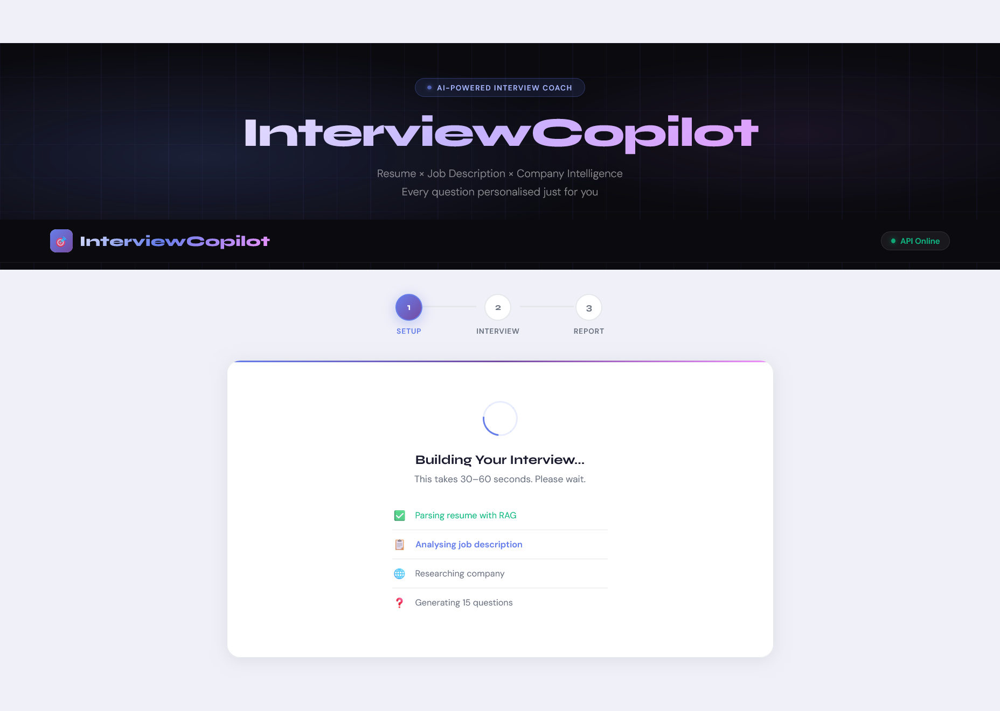
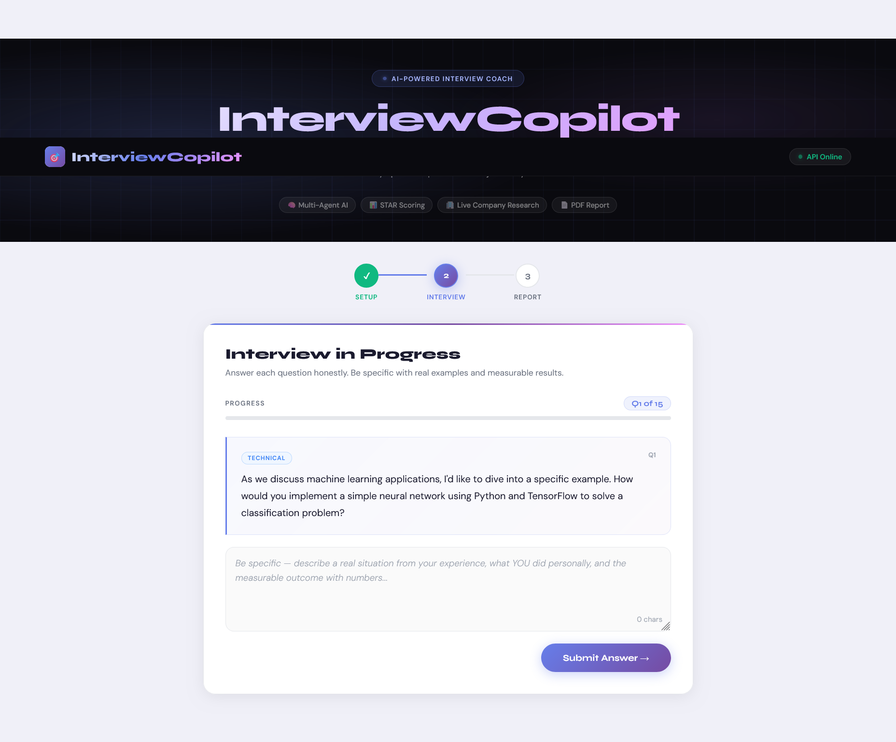
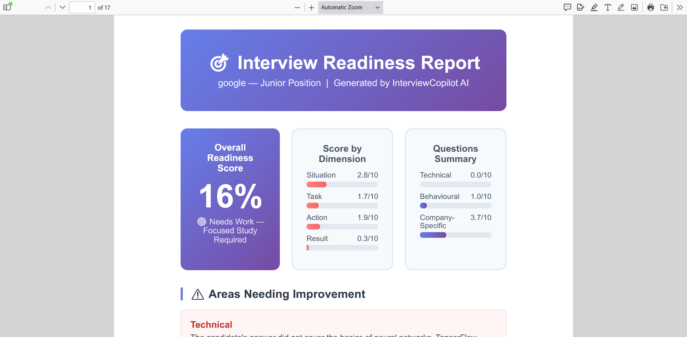

# 🎯 InterviewCopilot AI

> **AI-powered personalised interview coach** — Resume × Job Description × Company Intelligence

[](https://python.org)
[](https://langchain-ai.github.io/langgraph/)
[](https://fastapi.tiangolo.com)
[](https://www.trychroma.com)
[](https://console.groq.com)
[](https://docker.com)
[](https://huggingface.co/spaces)
[](LICENSE)

---

## 📋 Table of Contents

- [Overview](#-overview)
- [What Makes This Different](#-what-makes-this-different)
- [System Architecture](#-system-architecture)
- [Agents Explained](#-agents-explained)
- [STAR Scoring System](#-star-scoring-system)
- [Tech Stack](#-tech-stack)
- [Installation](#-installation)
- [Usage](#-usage)
- [Project Structure](#-project-structure)
- [API Endpoints](#-api-endpoints)
- [Screenshots](#-screenshots)
- [Troubleshooting](#-troubleshooting)
- [Future Improvements](#-future-improvements)
- [Contributing](#-contributing)
- [License](#-license)

---

## 🌟 Overview

Job interviews are stressful — and most mock interview tools give you generic questions from a question bank that have nothing to do with **your** resume or the **actual company** you are applying to.

**InterviewCopilot AI** solves this. It reads your specific resume, analyses the exact job description, researches the real company live on the web — then conducts a full personalised mock interview tailored specifically to you. At the end, it evaluates every answer using the **STAR framework** (used by Google, Amazon, Microsoft) and generates a downloadable **PDF readiness report** telling you exactly where you are weak and what to study next.

### What is Readiness Score?

The **Readiness Score** is a numeric percentage rating of your interview preparedness — just like a Fire Weather Index rates fire danger. The higher the score, the more prepared you are for the real interview.

---

## 🔑 What Makes This Different

| Feature | Generic Tools | InterviewCopilot AI |
|---------|--------------|---------------------|
| Question source | Generic Q&A bank | Resume × JD × Company (live) |
| Personalisation | None / low | Every question unique to YOU |
| Answer evaluation | Right / wrong only | STAR scoring 0–10 with reasoning |
| Difficulty | Fixed | Adapts based on your last score |
| Interview rounds | Single | Round 1: Technical → Round 2: HR |
| Web research | None | DuckDuckGo / Tavily live search |
| Architecture | Linear chain | **Cyclic LangGraph graph** |
| Output | Nothing | Full PDF readiness report |
| Notifications | None | Email on every report download |

---

## 🏗 System Architecture

The system is a **multi-agent pipeline** built on LangGraph. Each block is a separate AI agent. The cyclic loop in Stage 4 is what makes this architecturally unique — a pattern used in real production AI systems.



### Pipeline Overview

```
User Input (Resume + JD + Company Name)
              ↓
Stage 2 — Prep Agents (run in parallel)
├── Resume RAG Agent    → ChromaDB + sentence-transformers
├── JD Analyzer Agent   → Groq LLM → structured JSON
└── Company Intel Agent → Tavily / DuckDuckGo live web search
              ↓
    LangGraph Shared State
    resume_chunks · jd_skills · company_context · question_bank · scores
              ↓
Stage 3 — Question Generator Agent
    15 personalised questions (5 Technical + 5 Behavioural + 5 Company)
              ↓
Stage 4 — Cyclic Interview Loop ← KEY DIFFERENTIATOR
    Interviewer Agent ──answer──► Evaluator Agent
         ▲                              │
         └────────score · loop back─────┘
         (loops until all questions answered)
              ↓ when complete
Stage 5 — Report Generator Agent
    PDF · Readiness % · Weak Areas · Study Plan
              ↓
Deployment — FastAPI + HTML UI · Docker · HuggingFace Spaces
```

### Why LangGraph?

Most projects build a linear LangGraph pipeline (A→B→C→END). This project uses a **cyclic graph with conditional routing** — an advanced pattern essential for a back-and-forth interview conversation.

```python
def should_continue(state: AgentState) -> str:
    if state["is_complete"]:
        return "generate_report"   # exit loop → generate report
    return "ask_question"          # loop back → ask next question

workflow.add_conditional_edges(
    "evaluate_answer",
    should_continue,
    {
        "ask_question":    "ask_question",
        "generate_report": "generate_report",
    }
)
```

---

## 🤖 Agents Explained

### Resume RAG Agent
Reads the uploaded resume PDF using **PyPDF**, splits it into overlapping chunks, embeds each chunk using `sentence-transformers` (all-MiniLM-L6-v2), and stores in **ChromaDB**. When the Question Generator needs resume context, it queries semantically — finding the most relevant sections even if the exact words don't match.

**Key libs:** `langchain`, `chromadb`, `sentence-transformers`, `pypdf`

### JD Analyzer Agent
Takes the raw job description and extracts required skills, preferred skills, seniority level, key responsibilities, and tech stack using **Groq LLM** — returned as clean JSON.

**Key libs:** `langchain`, `langchain-groq`

### Company Intel Agent
Searches the web for real, current information about the target company — tech stack, culture values, interview reputation, and recent news. Uses **DuckDuckGo** (free, no key) by default and **Tavily** for production quality.

**Key libs:** `langchain_community DuckDuckGoSearchRun`, `langchain-tavily`

### Question Generator Agent
The most important agent. Receives all three prep outputs and generates **15 personalised questions** split into 5 Technical + 5 Behavioural + 5 Company-specific. Every question is unique to this candidate applying to this specific company.

**Key libs:** `langchain`, `langchain-groq`, `LangGraph state`

### Interviewer Agent
Manages conversation flow. Picks the next question from the bank, tracks which round we are in (Technical → HR), and adapts difficulty based on the previous STAR score. Uses `conditional_edges` in LangGraph.

**Key libs:** `langgraph StateGraph`, `conditional_edges`

### Answer Evaluator Agent
Receives the candidate's answer and scores it on all four STAR dimensions (0–10 each). Returns overall score, what was strong, what was missing, and a model answer. Score is stored in LangGraph state and used by the Interviewer to adapt the next question's difficulty.

**Key libs:** `langchain-groq`, `pydantic`

### Report Generator Agent
Reads all scores from the shared LangGraph state and generates a comprehensive HTML report rendered to PDF via **WeasyPrint**. Includes overall readiness %, per-topic breakdown, Q-by-Q review with model answers, weak areas, and a personalised study plan.

**Key libs:** `weasyprint`, `jinja2`

---

## ⭐ STAR Scoring System

STAR is the framework real interviewers at top companies like Google, Amazon, and Microsoft use to evaluate answers.

| Letter | Stands For | What It Checks | Common Weakness |
|--------|-----------|----------------|----------------|
| **S** | Situation | Did you set clear context? | Jumped to action without context |
| **T** | Task | Was your specific role clear? | Unclear what YOU were responsible for |
| **A** | Action | What did YOU personally do? | Said "we" instead of "I", too vague |
| **R** | Result | Was there a measurable outcome? | No numbers, no impact mentioned |

Each dimension scored **0–10**. The overall score drives adaptive difficulty:
- Score **< 4** → Easier follow-up on same topic
- Score **≥ 8** → Difficulty escalates next question

```json
{
  "S": 8, "T": 7, "A": 9, "R": 3,
  "overall": 6.75,
  "good": "Excellent situation setup with specific project context",
  "missing": "R score is 3/10 — add measurable numbers next time",
  "model_answer": "A top candidate would say: deployed in 2 days, achieved 96% accuracy..."
}
```

---

## 🛠 Tech Stack

| Layer | Technology | Purpose | New Skill |
|-------|-----------|---------|-----------|
| Agent Orchestration | **LangGraph** | Cyclic multi-agent state graph | ✅ NEW |
| Vector Store | **ChromaDB** | Resume embeddings for RAG | ✅ NEW |
| Embeddings | **sentence-transformers** | Text → vectors (all-MiniLM-L6-v2) | — |
| LLM | **Groq** (llama-3.3-70b) | Question gen, evaluation, report | — |
| Web Search | **DuckDuckGo / Tavily** | Live company research | ✅ NEW |
| Backend | **FastAPI** | REST API + HTML UI serving | — |
| Frontend | **HTML / CSS / JS** | 3-step wizard UI (no framework) | — |
| PDF Export | **WeasyPrint** | Downloadable readiness report | ✅ NEW |
| Templates | **Jinja2** | HTML report rendering | — |
| Containerisation | **Docker** | Packaging + deployment | ✅ NEW |
| Deployment | **HuggingFace Spaces** | Live public demo | — |
| Notifications | **Gmail SMTP** | Email on report download | ✅ NEW |
| Logging | **Python logging** | Rotating logs + colors | ✅ NEW |

---

## 🚀 Installation

### Prerequisites

- Python 3.11+
- pip
- Virtual environment (recommended)
- Docker Desktop (for containerised deployment)

### Step-by-Step Setup

**1. Clone the repository**
```bash
git clone https://github.com/pinkidagar18/interview-copilot.git
cd interview-copilot
```

**2. Create virtual environment**
```bash
python -m venv venv

# Windows
venv\Scripts\activate

# macOS / Linux
source venv/bin/activate
```

**3. Install dependencies**
```bash
pip install -r requirements.txt
```

**4. Set up environment variables**
```bash
cp .env.example .env
```

Edit `.env`:
```env
GROQ_API_KEY=your_groq_api_key_here
TAVILY_API_KEY=your_tavily_key_here

# Optional — email notifications when someone downloads report
NOTIFY_EMAIL=yourname@gmail.com
NOTIFY_PASSWORD=your_16_char_gmail_app_password
NOTIFY_TO=yourname@gmail.com
```

**5. Get free API keys**

| API | Where to get | Free limit |
|-----|-------------|-----------|
| Groq | [console.groq.com](https://console.groq.com) | 14,400 req/day |
| Tavily | [app.tavily.com](https://app.tavily.com) | 1,000 credits/month |
| DuckDuckGo | No key needed | Unlimited (default) |
| ChromaDB | No key needed — local | Unlimited |

**6. Run the application**
```bash
uvicorn api.main:app --reload --port 8000
```

Open browser at:
```
http://localhost:8000
```

---

## 🐳 Docker Deployment

```bash
# Build and start both servers
docker compose up --build

# UI:       http://localhost:8000
# API docs: http://localhost:8000/docs
```

---

## 💻 Usage

### Step 1 — Setup

Go to `http://localhost:8000` and provide:
- **Resume** — drag & drop PDF or paste text directly
- **Target Company** — e.g. Google, Flipkart, Microsoft
- **Job Description** — paste the full JD text

Click **"Generate My Interview"**. The system will show a live progress screen:

- ✅ Parsing resume with RAG
- 📋 Analysing job description
- 🌐 Researching company
- ❓ Generating 15 questions

> ⏱ This takes **30–60 seconds**. All agents run sequentially.

### Step 2 — Interview

Answer each question in the text area. Tips for high scores:
- **Situation** — set the scene clearly (which project, when, what problem)
- **Task** — make your specific role crystal clear
- **Action** — use "I did X" not "we did X" — be specific and detailed
- **Result** — always add numbers: "96% accuracy", "40% latency reduction", "zero downtime"

After every answer you see your **S · T · A · R breakdown** with specific feedback and a model answer.

### Step 3 — Report

After all 15 questions you receive:
- Overall **readiness percentage** with verdict
- Per-dimension STAR score breakdown
- Per-category scores (Technical / Behavioural / Company-Specific)
- Model answers for every question
- Personalised **study plan** with resources
- Download your full **PDF readiness report**

---

## 📁 Project Structure

```
interview-copilot/
│
├── api/
│   └── main.py                     # FastAPI — routes, middleware, exception handlers
│
├── agents/
│   ├── resume_parser.py            # Resume RAG agent
│   ├── jd_analyzer.py              # Job description analyzer
│   ├── web_researcher.py           # Company intel (DuckDuckGo / Tavily)
│   ├── question_generator.py       # 15-question personalised generator
│   ├── interviewer.py              # Conversation flow manager
│   ├── answer_evaluator.py         # STAR scoring engine
│   └── report_generator.py        # PDF report creator
│
├── graph/
│   ├── state.py                    # AgentState TypedDict (shared state)
│   └── workflow.py                 # LangGraph cyclic graph + conditional edges
│
├── tools/
│   ├── chroma_store.py             # ChromaDB setup, store, query helpers
│   ├── search_tool.py              # DuckDuckGo / Tavily switcher
│   └── pdf_loader.py              # Resume PDF text extractor + chunker
│
├── utils/
│   ├── logger.py                   # Structured logging, colors, SessionLogger
│   ├── exceptions.py               # 15+ custom exception classes
│   └── notifier.py                 # Gmail SMTP email notification
│
├── templates/
│   ├── index.html                  # 3-step wizard UI (HTML/CSS/JS)
│   └── report_template.html        # Jinja2 PDF report template
│
├── outputs/                        # Generated PDF reports
├── logs/                           # Rotating application logs (5MB max)
├── chroma_db/                      # Local ChromaDB vector store
├── screenshots/                    # Project screenshots for README
│
├── Dockerfile
├── docker-compose.yml
├── start.sh                        # Startup script (FastAPI + Streamlit)
├── requirements.txt
├── .env.example
└── README.md
```

---

## 🔌 API Endpoints

### 1. Serve UI
```
GET /
```
Returns the main HTML wizard interface from `templates/index.html`.

### 2. Health Check
```
GET /health
```
```json
{
  "status": "ok",
  "message": "InterviewCopilot API is running!",
  "version": "1.0.0",
  "active_sessions": 2
}
```

### 3. Upload Resume PDF
```
POST /upload-resume
Content-Type: multipart/form-data
```
```json
{
  "resume_text": "extracted text...",
  "character_count": 2341,
  "message": "Resume extracted successfully"
}
```

### 4. Start Interview Session
```
POST /start
```
Request:
```json
{
  "resume_text": "Pinki Dagar — Python Developer...",
  "jd_text": "Python Backend Engineer — AI Team...",
  "company_name": "Google"
}
```
Response:
```json
{
  "session_id": "a3f8b2c1",
  "current_question": "How would you implement a neural network using TensorFlow...",
  "question_number": 1,
  "total_questions": 15,
  "question_type": "technical",
  "round": "technical"
}
```

### 5. Submit Answer
```
POST /answer
```
Request:
```json
{
  "session_id": "a3f8b2c1",
  "answer": "In my NetShield project, I deployed a phishing detection API..."
}
```
Response:
```json
{
  "scores": {
    "S": 8, "T": 7, "A": 9, "R": 6,
    "overall": 7.5,
    "good": "Clear situation with specific project context",
    "missing": "No measurable result — add numbers next time",
    "question_type": "technical"
  },
  "next_question": "Tell me about a time when...",
  "question_number": 2,
  "is_complete": false,
  "message": "Q2 of 15"
}
```

### 6. Download Report
```
GET /report/{session_id}
```
Returns PDF file download. Also triggers email notification to you.

### 7. Session Status
```
GET /status/{session_id}
```
```json
{
  "session_id": "a3f8b2c1",
  "is_complete": false,
  "current_question": 5,
  "total_questions": 15,
  "progress_pct": 33,
  "current_round": "technical",
  "scores_so_far": 4
}
```

### 8. Admin — List Sessions
```
GET /admin/sessions
```
View all active sessions, companies, and average scores — for monitoring.

---

## 📸 Screenshots

### 1. Setup Page — Step 1
Upload your resume PDF or paste text, enter target company and full job description to begin your personalised interview.



---

### 2. Loading — Building Your Interview
Live progress screen showing all 4 prep agents running — Resume RAG, JD Analysis, Company Research, and Question Generation.



---

### 3. Interview Page — Step 2
Live Q&A with color-coded question types (Technical / Behavioural / Company-Specific), STAR score feedback after every answer, and progress tracking.



---

### 4. Interview Readiness Report — PDF Output
Full PDF report with overall readiness %, per-dimension STAR scores, areas needing improvement, model answers, and a personalised study plan — generated by Google — Junior Position session.




---

## 🔧 Troubleshooting

This section documents common issues and their solutions.

### Common Issues & Solutions

#### 1. Groq API Quota Error (429)
**Issue:** `LLMQuotaError: Groq API quota exceeded`

**Cause:** Free tier rate limit hit — limited requests per minute.

**Solution:**
```bash
# Wait 60 seconds and retry
# Check your usage at console.groq.com
# The app auto-detects this and returns a clean 429 error message
```

#### 2. ChromaDB Collection Error
**Issue:** Embedding dimension mismatch or collection already exists.

**Solution:**
```bash
# Delete local ChromaDB and restart
rm -rf chroma_db/
uvicorn api.main:app --reload --port 8000
```

#### 3. WeasyPrint GTK Error on Windows
**Issue:** `cannot load library 'libgobject-2.0-0'`

**Solution:**
Download GTK3 runtime for Windows:
```
https://github.com/tschoonj/GTK-for-Windows-Runtime-Environment-Installer/releases
```
Run the installer → restart VS Code → PDF generation works.

#### 4. Session Not Found (404)
**Issue:** `SessionNotFoundError: Session 'abc' not found`

**Cause:** Sessions are stored in memory — server restart clears them.

**Solution:** Start a new interview session. For persistent sessions, configure Redis.

#### 5. PDF Empty or Won't Open
**Issue:** Downloaded PDF is blank.

**Cause:** Interview not fully complete — all 15 questions must be answered.

**Solution:** Answer all questions in the Interview tab before downloading.

#### 6. Resume PDF Upload Fails
**Issue:** PDF upload returns error or extracts empty text.

**Cause:** Scanned PDFs (image-only) cannot be text-extracted without OCR.

**Solution:**
```bash
# Test extraction directly
curl -X POST http://localhost:8000/upload-resume \
  -F "file=@your_resume.pdf"

# Use a text-based PDF (not a scanned image PDF)
# Or paste resume text directly in the text area
```

#### 7. DuckDuckGo Search Failing
**Issue:** Company research returns empty or fails.

**Solution:** Add Tavily API key for higher quality results:
```env
TAVILY_API_KEY=your_tavily_key_here
```
Tavily gives 1,000 free credits/month.

#### 8. Port Already in Use
**Issue:** `[Errno 48] Address already in use`

**Solution:**
```bash
# Windows
netstat -ano | findstr :8000
taskkill /PID <PID> /F

# Mac/Linux
lsof -i :8000
kill -9 <PID>

# Or use a different port
uvicorn api.main:app --reload --port 8001
```

#### 9. Email Notifications Not Sending
**Issue:** No email received after report download.

**Cause:** Gmail requires an App Password — not your regular password.

**Solution:**
1. Go to **myaccount.google.com** → Security
2. Enable **2-Step Verification**
3. Go to **App passwords** → Create new → name it `InterviewCopilot`
4. Copy the 16-character password → paste in `.env` as `NOTIFY_PASSWORD`

#### 10. Negative or 0% Readiness Score
**Issue:** Overall score shows 0% or very low even with answers.

**Cause:** Answers were too short or didn't match the question asked.

**Solution:** Provide detailed answers — minimum 3–4 sentences using the STAR format. Single-word or irrelevant answers score 0 on all dimensions.

### Debugging Tools

```bash
# View rotating application logs
cat logs/app.log

# Check active sessions
curl http://localhost:8000/admin/sessions

# Health check
curl http://localhost:8000/health

# Test resume extraction
curl -X POST http://localhost:8000/upload-resume \
  -F "file=@resume.pdf"

# Check Python environment
python --version
pip list | grep -i langchain
pip list | grep -i groq
```

---

## 🔮 Future Improvements

- [ ] Real-time speech-to-text answer submission (voice interview mode)
- [ ] Video interview mode with body language analysis
- [ ] Multi-language support (Hindi, Tamil, Telugu, Kannada)
- [ ] Company-specific question banks from real interview reports
- [ ] LinkedIn integration for auto resume import
- [ ] Persistent session storage (Redis / PostgreSQL)
- [ ] Analytics dashboard for tracking progress over time
- [ ] Mock Group Discussion feature
- [ ] Resume scoring and improvement suggestions before interview
- [ ] Interview scheduling with calendar integration
- [ ] LangSmith tracing for agent observability
- [ ] Ensemble LLM routing (Groq + Gemini + Claude)

---

## 🤝 Contributing

Contributions are welcome! Please follow these steps:

1. Fork the repository
2. Create a feature branch (`git checkout -b feature/AmazingFeature`)
3. Commit your changes (`git commit -m 'Add some AmazingFeature'`)
4. Push to the branch (`git push origin feature/AmazingFeature`)
5. Open a Pull Request

### Development Guidelines

- Follow **PEP 8** for Python code
- Each agent must have a standalone test file (`test_<agent>.py`)
- Test each agent **in isolation** before connecting to LangGraph
- Use `utils/logger.py` for all logging — never use bare `print()`
- Raise custom exceptions from `utils/exceptions.py`
- Keep agent files single-responsibility — one agent per file

---

## 📄 License

This project is licensed under the MIT License — see the [LICENSE](LICENSE) file for details.

---

## 👥 Author

**Pinki Dagar**
- Email: [pinkidagar18@gmail.com](mailto:pinkidagar18@gmail.com)
- GitHub: [@pinkidagar18](https://github.com/pinkidagar18)
  

---

## 🙏 Acknowledgments

- LangChain / LangGraph team for the multi-agent framework
- Groq for blazing-fast free LLM inference
- ChromaDB for the local vector store
- Tavily for real-time web search API
- HuggingFace for free model hosting and Spaces deployment
- WeasyPrint for HTML → PDF generation
- The open-source community

---

## 📚 References

- [LangGraph Documentation](https://langchain-ai.github.io/langgraph/)
- [ChromaDB Documentation](https://docs.trychroma.com)
- [Groq API Documentation](https://console.groq.com/docs)
- [FastAPI Documentation](https://fastapi.tiangolo.com)
- [WeasyPrint Documentation](https://doc.courtbouillon.org/weasyprint)
- [STAR Interview Method](https://www.indeed.com/career-advice/interviewing/how-to-use-the-star-interview-response-technique)
- [sentence-transformers](https://www.sbert.net)

---

> Made with ❤️ for every student preparing for their dream internship


